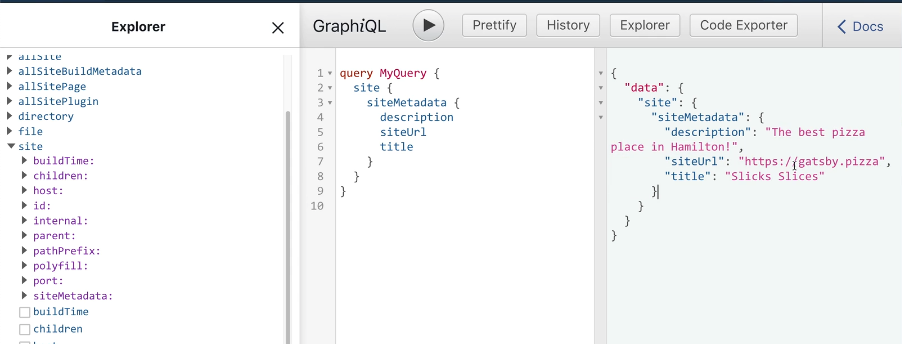

## Intro to gatsby-config and sourcing data

how to surface data from Sanity into GraphQL explorer to see data listed in the queries?

WE do this via plugins, which are defined in gatsby-config.js.


how to write a query in graphQL: you type query and {}

```
query {
	site {
		siteMetadata {
			description
			siteUrl
			title
		}
	}
}
```



we use a pluging that will source data from sanity and then use graphQL to query


GRaphiQL is an in-browser tool for writing, validating and testing GraphQL queries. 