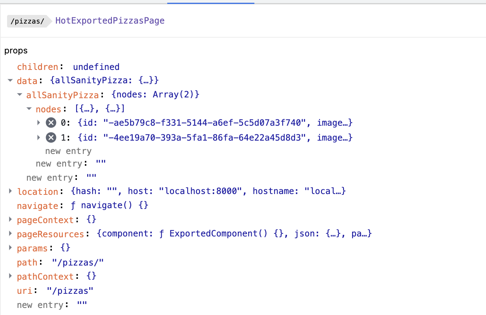
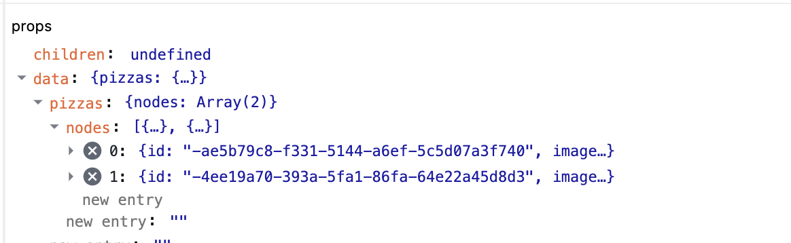

## Learn Gatsby queries

two different types of queries that live in Gatsby:

- Page queries:
  - can be dynamic with variables
  - can only be run on a top level page
- static queries:
  - cannot be dynamic, no variables can be passed in
  - can be run anywhere


page queries:

you export a query from the page and gatsby knwos its a query and gets the data when we run the build and pass it to the page component.


we write the queries there


---

fragment graphql





rename a querys

```js
export const query = graphql`
  query PizzaQuery {
    pizzas: allSanityPizza {
      nodes {
        name
        id
        slug {
          current
...
```

rename from allSanityPizza to pizzas




