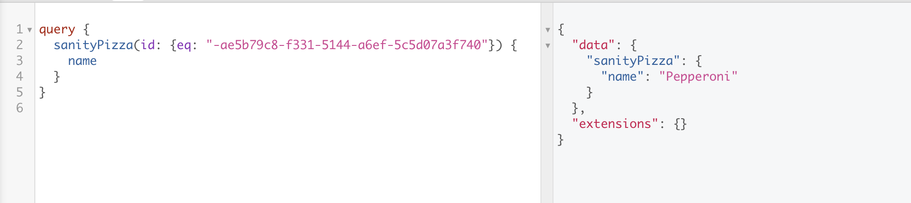

ways of specifying plugins in gatsby:

- plugin array: use name of the plugin and accept all default options


```js
export default {
  siteMetadata: {
    title: `Slick Slices`,
    siteUrl: `https://gatsby.pizza`,
    description: `The best pizza place in Hamilton!`,
  },
  plugins: [
    ''
  ]
};
```

if settings, we pass an object and have a resolve property that is the name of the plugin we are passing. it has options object where we pass the options


watchMode: true --> when you are in development an dyou make a change in sanity and save, it will automatically be updated in gatsby. 


you ahve to add a CORS origin


don't put sensitive information in gatsby-config even if not going to be surgafaced via website but this file goes into the version control, going into Git. 

what to do?

put it in a .env file.

```
SANITY_TOKEN = 'secret's
```

how to access: process.eng.SANITY_TOKEN

we have to import dotenv from 'dotenv';

by default gatsby will surface tokens that start with GATSBY_....


```js
import dotenv from 'dotenv';

dotenv.config({ path: '.env' });

export default {
  siteMetadata: {
    title: `Slick Slices`,
    siteUrl: `https://gatsby.pizza`,
    description: `The best pizza place in Hamilton!`,
  },
  plugins: [
    'gatsby-plugin-styled-components',
    {
      resolve: 'gatsby-source-sanity',
      options: {
        projectId: 'nwtgevqj',
        dataset: 'production',
        watchMode: true,
        token: process.env.SANITY_TOKEN,
      },
    },
  ],
};

```


----


we need to deploy graphql API

 sanity graphql deploy production

production = name of the dataset


----

take data from sanity and stick it into the gatsby graphql API


----

cool thing about graphQL: you can query as much data as you want in same query you can query all pizzas and people.

there's only one endpoint in graphql and you can grab all data you want.


query by pizza id

```js
query {
  sanityPizza(id: {eq: "XXX"}) {
    name
  }
}
```

double quotes

we don't need nodes anymore because it's not an array

